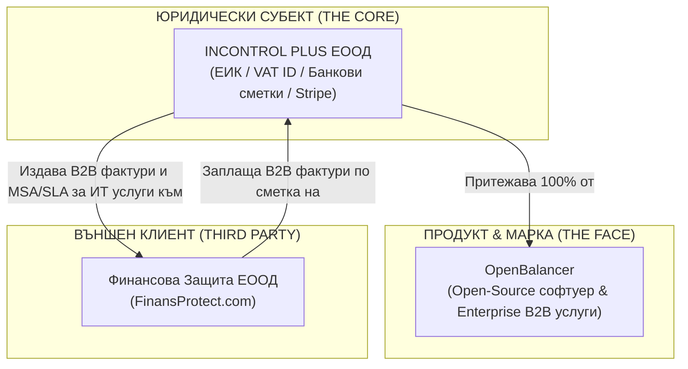

# Brand Isolation & Legal Architecture Matrix (Правна Архитектура и Изолация на Брандовете)

**Документ за вътрешен контрол и спазване на регулаторните изисквания (Compliance Protocol)**  
**Версия:** 1.0  
**Дата:** Август 2026  
**Организация:** INCONTROL PLUS ЕООД

---

## 1. Резюме на Правната Структура (Executive Summary)

За да се елиминира 100% рискът от блокиране на сметки и платежни системи (Stripe, Revolut Business, банки) поради съмнения за *Payment Aggregation*, *Fronting* (скрито обслужване на чужди плащания) или *Money Laundering*, цялата дейност е структурирана по строг йерархичен модел:

---

## 2. Роли и Дефиниция на Субектите

### 2.1. Юридическото лице (The Core): INCONTROL PLUS ЕООД
* **Статут:** Единственият правен субект в системата.
* **Отговорности:**
  - Сключва всички договори за услуги (B2B Master Services Agreements).
  - Притежава и оперира платежния профил в Stripe.
  - Притежава банковите сметки (Revolut Business / български IBAN).
  - Издава данъчни фактури и отчита приходите съгласно българското и европейското законодателство.
  - Притежава пълните авторски и търговски права върху продукта **OpenBalancer**.

### 2.2. Продуктът и Търговската марка (The Face): OpenBalancer
* **Статут:** Софтуерен продукт и търговско наименование, 100% собственост на INCONTROL PLUS ЕООД.
* **Функция:**
  - Open-Source високоскоростен Load Balancer и Reverse Proxy за съвременни AI и микросървисни архитектури.
  - Позициониран в GitHub и `openbalancer.com` с MIT лиценз за комюнити версията.
  - Служи за привличане на Enterprise клиенти за платени SLA абонаменти, внедряване и ИТ поддръжка от INCONTROL PLUS ЕООД.
* **Правна забележка:** OpenBalancer НЕ е отделна фирма или субект. Всички плащания и търговски съобщения ясно посочват: *"OpenBalancer is operated by INCONTROL PLUS ЕООД"*.

### 2.3. Клиентът (The Third Party): FinansProtect (Финансова Защита ЕООД)
* **Статут:** Външен търговски клиент на агенцията.
* **Функция:**
  - Получава ИТ услуги: внедряване на софтуерна инфраструктура, настройка на балансьори на натоварването за защита от отказ на сървъри, оптимизация на лийд фунии и трафик мениджмънт.
  - Получава регулярни B2B фактури с 14-дневен срок за плащане.
* **Категорична правна изолация:**
  - В нито един официален документ, сайт или промоционален материал на OpenBalancer не се твърди собственост или съдружие с FinansProtect.
  - FinansProtect се споменава единствено като **B2B Case Study / Клиентска референция** ("Trusted by forward-thinking fintech and protection leaders like FinansProtect").

---

## 3. Рискови сценарии и Защитни мерки (Anti-Ban Guardrails)

| Сценарий на риск | Причина за потенциален бан | Защитен механизъм (Guardrail) |
| :--- | :--- | :--- |
| **Payment Fronting** | Поставяне на Stripe бутон на сайта на FinansProtect за плащане на застраховки/финансови услуги от физически лица през Stripe на Incontrol Plus. | **СТРИКТНО ЗАБРАНЕНО.** Stripe сметката на Incontrol Plus обработва САМО B2B фактури, издадени от Incontrol Plus към юридически лица. Физическите лица на FinansProtect плащат през собствен платежен оператор на Финансова Защита ЕООД. |
| **Неясен предмет на дейност (KYB Failure)** | Липса на ясна корелация между софтуерния продукт и фактурираните суми. | Всяка фактура съдържа прецизно описание: *"Абонаментна поддръжка и SLA за софтуерна инфраструктура OpenBalancer за м. [Месец/Година]"* съгласно Договор за поддръжка № [Номер]. |
| **Chargeback / Refund риск** | Висок процент оспорени плащания от крайни потребители. | B2B транзакциите по фактури между корпоративни клиенти имат практически 0% chargeback риск, тъй като се базират на сключен MSA и приемо-предавателен протокол. |
| **Липса на онлайн верификация** | Проверяващият от Stripe не открива съответствие между фирмата, сайта и адреса. | Футърът на `openbalancer.com` съдържа 1:1 същите фирмени данни (Име, Адрес, ЕИК/ДДС, Телефон, Email), които са попълнени в Stripe формуляра. |

---

## 4. Оперативен Протокол за Сътрудничество с Външни Клиенти

1. **Сключване на Master Services Agreement (MSA)**: Подписва се двустранен рамков договор между INCONTROL PLUS ЕООД и съответния клиент (напр. Финансова Защита ЕООД).
2. **Издаване на Statement of Work (SOW)**: Дефинират се конкретните цели (напр. разгръщане на OpenBalancer клъстер, SLA за наличност 99.9%).
3. **Месечно фактуриране през Stripe Invoicing**:
   - Incontrol Plus генерира инвойс директно в Stripe.
   - Клиентът получава официален линк за плащане и банкови реквизити.
   - Плащането се отразява автоматично в Stripe и се превежда към Revolut Business/банковата сметка на Incontrol Plus.
4. **Месечен приемо-предавателен протокол**: Издава се кратък отчет за извършената работа и постигнатия SLA.
