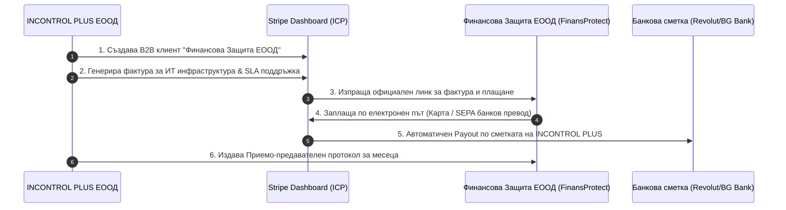

# Оперативен Протокол за B2B Фактуриране към FinansProtect
## (B2B Billing Workflow & Anti-Aggregation Guardrails)

**Документ:** Оперативна инструкция за монетизация и обслужване  
**Страни:** INCONTROL PLUS ЕООД (Изпълнител) -> „Финансова Защита“ ЕООД / FinansProtect (Клиент)  
**Статут:** Задължителен за спазване

---

## 1. Схема на Оперативния Процес

---

## 2. Стъпка по Стъпка: Фактуриране в Stripe Dashboard

### Стъпка 1: Създаване на Клиент в Stripe
1. Влезте в Stripe Dashboard -> **Customers** -> **Add customer**.
2. Попълнете данните на клиента:
   - **Name:** `Финансова Защита ЕООД` (или `FinansProtect Ltd.`)
   - **Email:** [Официален счетоводен/мениджърски имейл на Финансова Защита]
   - **Description:** `B2B Enterprise Client for OpenBalancer Infrastructure & SLA`
   - **Billing details:**
     - Address: [Седалище и адрес на управление на Финансова Защита ЕООД]
     - Country: `Bulgaria`
   - **Tax ID:** Въведете `BG[ЕИК на Финансова Защита]`

### Стъпка 2: Генериране на Месечен Инвойс (Create Invoice)
1. Отидете на **Invoices** -> **Create invoice**.
2. Изберете клиент: `Финансова Защита ЕООД`.
3. Добавете артикул (Line item):
   - **Item name:** `OpenBalancer Enterprise Infrastructure & SLA Retainer`
   - **Description:** `Управление на дигитална инфраструктура, трафик мениджмънт и SLA мониторинг за м. [Месец/Година] съгласно Договор № ICP-MSA-2026-001`
   - **Price:** [Договорената месечна сума, напр. 1,500.00 EUR]
   - **Quantity:** `1`
4. **Payment terms:** Задайте `Net 14 days`.
5. **Payment methods:** Маркирайте `Credit/Debit Card` и `Bank Transfer`.
6. Натиснете **Review invoice** и след това **Send invoice**.

### Стъпка 3: Плащане и Осчетоводяване
- Клиентът получава имейл с PDF фактура и бутон за плащане.
- При плащане Stripe автоматично отчита транзакцията и изпраща средствата към банковата сметка на INCONTROL PLUS ЕООД.
- В края на месеца се подписва **Приемо-предавателен протокол** (Acceptance Certificate) съгласно образеца в `B2B_Statement_Of_Work_SLA_Template.md`.

---

## 3. ЧЕРВЕНИ ЛИНИИ (Критични забрани за предпазване от Lifetime Ban)

> [!CAUTION]
> **1. ЗАБРАНЕНО Е СМЕСВАНЕТО НА РАЗПЛАЩАНИЯТА (Anti-Aggregation / No Fronting):**  
> НИКОГА не поставяйте код за плащане (Stripe Checkout бутон, iframe или payment link), генериран от акаунта на **INCONTROL PLUS**, директно на сайта `finansprotect.com` за плащане на застрахователни премии или финансови консултации от крайни физически лица.

> [!CAUTION]
> **2. ОТДЕЛЕН ПЛАТЕЖЕН ПРОЦЕСОР ЗА КРАЙНИТЕ КЛИЕНТИ НА FINANSPROTECT:**  
> Всички плащания от крайни потребители на FinansProtect за застраховки или финансови услуги ТРЯБВА да минават през отделен виртуален ПОС терминал или платежен процесор (напр. MyPOS, Borica, Paysera, Stripe), регистриран **директно и самостоятелно на името на „Финансова Защита“ ЕООД**.

> [!IMPORTANT]
> **3. ЧИСТИ B2B ТРАНЗАКЦИИ В СМЕТКАТА НА INCONTROL PLUS:**  
> През Stripe профила на INCONTROL PLUS трябва да минават **САМО И ЕДИНСТВЕНО B2B фактури**, издадени от Incontrol Plus към юридически лица за софтуерни, инфраструктурни и консултантски услуги.

Следването на този протокол гарантира 100% правна чистота, нулев chargeback риск и пълно съответствие с изискванията на международните финансови регулатори.
