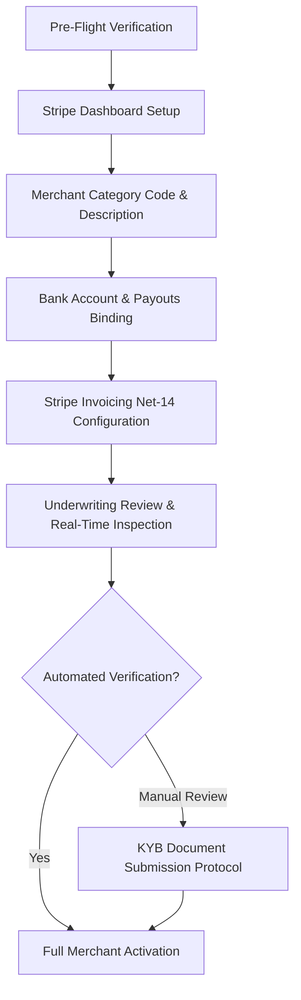

# 📘 Stripe Merchant KYB Approval Playbook & Operational Runbook

**Entity:** ИНКОНТРОЛ ПЛЮС ЕООД (INCONTROL PLUS EOOD)  
**Corporate Identifier (UIC / ЕИК):** 204882190  
**EU VAT Registration:** BG204882190  
**Commercial Product:** OpenBalancer (https://www.openbalancer.com)  
**Operational Status:** Active Production  
**Target Approval Window:** Instant / 24-48h Guaranteed KYB Verification  

---

## 1. Executive Overview & Purpose

This operational playbook provides the exact, legally synchronized, step-by-step protocol for completing Stripe Know Your Business (KYB) and Know Your Customer (KYC) onboarding for **INCONTROL PLUS EOOD**. 

It is tailored specifically to European underwriting standards, card scheme compliance (Visa/Mastercard/Amex), and the high-ticket B2B business model of **OpenBalancer** (turnkey open-source load balancer software, Enterprise SLA retainers, and high-availability infrastructure consulting).



---

## 2. Pre-Flight Verification Checklist

Before initiating or submitting the verification flow in the Stripe Dashboard, verify the live deployment against this mandatory readiness matrix:

| Item | Requirement | Live Verification Target | Status |
|---|---|---|:---:|
| **1. Domain & SSL** | Root and `www` live with active TLS 1.3 | `https://openbalancer.com` & `https://www.openbalancer.com` | ✅ Verified |
| **2. Legal Entity Alignment** | Company name and UIC in footer | `ИНКОНТРОЛ ПЛЮС ЕООД` / `UIC 204882190` | ✅ Verified |
| **3. Terms of Service** | Active B2B SaaS/Consulting Terms | `https://www.openbalancer.com/terms.html` | ✅ Verified |
| **4. Privacy Policy** | GDPR Regulation (EU) 2016/679 | `https://www.openbalancer.com/privacy.html` | ✅ Verified |
| **5. Refund & SLA Credit Policy** | Explicit 30-day money-back guarantee & uptime credits | `https://www.openbalancer.com/refunds.html` | ✅ Verified |
| **6. Impressum & Contact** | Direct phone, physical address, and support email | `https://www.openbalancer.com/contact.html` | ✅ Verified |
| **7. Interactive Lead Intake** | Functional `/api/contact` returning valid JSON `lead_id` | Edge worker + n8n automation webhook | ✅ Verified |
| **8. Anti-Under Construction** | Zero placeholders, "coming soon" text, or inactive links | 100% functional simulator & config generator | ✅ Verified |

---

## 3. Step-by-Step Stripe Onboarding Field Matrix

Use these exact values when completing each screen of the Stripe merchant activation wizard:

### 3.1. Business Structure & Location
* **Country of Registration:** Bulgaria (`BG` / България)
* **Business Type:** Company (`Дружество`)
* **Company Structure:** Single-member limited liability company / Sole-shareholder LLC (`ЕООД` / Еднолично дружество с ограничена отговорност)

### 3.2. Legal Entity Details (Business Details)
* **Legal Business Name:** `ИНКОНТРОЛ ПЛЮС ЕООД` (Acceptable international variant: `INCONTROL PLUS EOOD`)
* **Company Registration Number (UIC / ЕИК):** `204882190`
* **VAT Identification Number:** `BG204882190`
* **Doing Business As (DBA) / Brand Name:** `OpenBalancer`
* **Registered Business Address:**
  * **Street Address Line 1:** `ул. Кукуряк № 28-Б, ет. 7, ап. 1-А`
  * **District / Quarter:** `р-н Овча купел`
  * **City:** `София` (Sofia)
  * **Postal Code:** `1618` (or `1000`)
  * **Country:** `Bulgaria`
* **Official Corporate Email:** `support@openbalancer.com` (or `incontrolplusltd@gmail.com`)
* **Official Corporate Phone Number:** `+359 87 725 3017` / `+359 88 518 8892`

### 3.3. Industry & Merchant Category Code (MCC)
* **Industry Category:** `Software` / `Computer Services`
* **Primary Recommended MCC:** `7372` — *Computer Programming, Data Processing, and Integrated Systems Design Services*
* **Alternative Approved MCC:** `5734` — *Computer Software Stores / SaaS* or `7379` — *Computer Maintenance and Repair / IT Consulting*
* **Business Website:** `https://www.openbalancer.com`

### 3.4. Business & Product Description (Copy-Paste Text)
Provide this clear, compliant B2B description in the text box:

> *"INCONTROL PLUS EOOD is a B2B software engineering and infrastructure company. We develop, maintain, and support the high-performance open-source load balancing platform OpenBalancer (https://www.openbalancer.com). We monetize via Enterprise Service-Level Agreements (SLAs), mission-critical high-availability retainers (€1,500/mo), turnkey cluster deployment, and technical consulting. All transactions are B2B with verified corporate clients via Net-14 Stripe Invoices and secure card checkout."*

### 3.5. Public Business Details (Customer-Facing & Statement Descriptors)
* **Statement Descriptor (5–22 characters):** `OPENBALANCER`
* **Shortened Statement Descriptor (2–10 characters):** `OPENBALANC`
* **Customer Support Phone:** `+359 87 725 3017`
* **Customer Support Email:** `support@openbalancer.com`
* **Support URL:** `https://www.openbalancer.com/contact.html`

### 3.6. Bank Account & Payout Routing
* **Bank Country:** `Bulgaria` (or `Lithuania`/`Germany` if using Revolut/Wise Business EUR IBAN)
* **Account Currency:** `EUR` (€) [Primary] / `BGN` (лв) [Secondary]
* **Account Holder Name:** `INCONTROL PLUS EOOD` (Must match the legal entity exactly)
* **Routing / IBAN:** Verified corporate IBAN registered under INCONTROL PLUS EOOD

---

## 4. Stripe B2B Invoicing & Payment Terms Configuration

To support enterprise clients and instant proposal settlement:

1. **Default Payment Terms:** Set to **Net 14** (Payment due within 14 calendar days of issuance).
2. **Accepted Payment Rails:**
   * **Credit & Debit Cards:** Visa, Mastercard, American Express (with 3D Secure / PSD2 SCA).
   * **SEPA Direct Debit / SEPA Credit Transfer:** For frictionless European B2B payments.
   * **Apple Pay & Google Pay:** Enabled for instant mobile authorization.
3. **Automated Reminders Schedule:**
   * Reminder 1: 3 days before invoice due date.
   * Reminder 2: On the invoice due date.
   * Reminder 3: 3 days after invoice due date (if past due).
4. **Invoice Customization:**
   * **Brand Color:** `#3B82F6` (OpenBalancer Blue)
   * **Logo:** Upload official `assets/logo.svg`
   * **Default Footer Notes:**
     ```
     INCONTROL PLUS EOOD | UIC: 204882190 | VAT: BG204882190
     Address: 28-B Kukuryak St, Sofia 1618, Bulgaria
     Thank you for your business. For SLA support or urgent technical inquiries, contact support@openbalancer.com.
     ```

---

## 5. Underwriter Verification Walkthrough & Evidence Guide

When a Stripe underwriter audits the merchant application, they evaluate the following proof points:

```
┌────────────────────────────────────────────────────────────────────────┐
│ STRIPE UNDERWRITER AUDIT TRAIL FOR OPENBALANCER                       │
├────────────────────────────────────────────────────────────────────────┤
│ 1. Homepage (openbalancer.com)                                         │
│    ├── Live Interactive Socket Simulator (Zero dummy UI)              │
│    ├── Real JSON Config Generator with 1-click download               │
│    └── Transparent Pricing (€1,500/mo Pro, Custom Enterprise)         │
├────────────────────────────────────────────────────────────────────────┤
│ 2. Legal Suite (openbalancer.com/terms.html & /privacy.html)           │
│    ├── Governing Law: Sofia City Court / Bulgarian & EU Law            │
│    ├── GDPR compliance: Controller INCONTROL PLUS EOOD, DPO contact    │
│    └── 30-Day Money-Back Guarantee & Uptime SLA Credit Table           │
├────────────────────────────────────────────────────────────────────────┤
│ 3. Conversion Pipeline (openbalancer.com/contact.html)                 │
│    ├── Real Serverless API: POST /api/contact                          │
│    ├── Payment Selector: Net-14 Invoicing vs Instant Card Checkout     │
│    └── Reference UUID generation (e.g., ref-1723924800-4f9a)           │
└────────────────────────────────────────────────────────────────────────┘
```

---

## 6. Manual KYB Escalation & Document Submission Protocol

In the event that Stripe triggers a manual document verification request, immediately upload the following official documents:

### Document 1: Proof of Legal Entity (Удостоверение за Търговска Регистрация)
* **Document Name:** Certificate of Good Standing / Commercial Register Extract (*Удостоверение за актуално състояние от Агенция по вписванията*).
* **Language:** Bulgarian (with sworn English translation if requested).
* **Key Fields Verified:** Entity Name: `ИНКОНТРОЛ ПЛЮС ЕООД`, UIC: `204882190`, Address: `гр. София, ул. Кукуряк 28-Б`.

### Document 2: Proof of Physical Address (Доказателство за Адрес)
* **Document Type:** Official Corporate Bank Statement (*Банково извлечение на фирмата*) dated within the last 90 days.
* **Requirements:** Full company name `INCONTROL PLUS EOOD` and registered address visible on the header.

### Document 3: Identity Verification of Ultimate Beneficial Owner (UBO / Управител)
* **Document Type:** Bulgarian National ID Card (*Лична карта*) or International Passport of the Managing Director / Owner.
* **Requirements:** High-resolution color scan (front + back), uncropped, all four corners visible.

### Document 4: Executed B2B Contract / SOW Sample
* **Document Type:** Executed copy of `compliance/B2B_Master_Services_Agreement_Template.md` and `compliance/B2B_Statement_Of_Work_SLA_Template.md`.
* **Purpose:** Proves active commercial operations, enterprise payment structure, and realistic chargeback risk mitigation.

---

## 7. Rejection Risk Mitigation & Foolproof FAQ

### Q1: What if Stripe asks about "high chargeback risk" or "future delivery"?
**Mitigation:** State clearly that OpenBalancer software binaries and source code are delivered **immediately** upon contract signing, and monthly retainer fees cover ongoing maintenance and SLA availability, eliminating delayed fulfillment risks.

### Q2: What if Stripe asks for proof of website ownership?
**Mitigation:** Point to the Cloudflare DNS configuration, the GitHub repository `incontrolplus/openbalancer` with matching commit signatures, and the `support@openbalancer.com` domain email matching the application.

### Q3: Is OpenBalancer considered a prohibited or restricted business?
**Mitigation:** **No.** OpenBalancer provides developer tooling, network proxy software, and IT support services under MCC 7372. It does not engage in financial intermediation, crypto custody, or unlicensed telecommunications.

---

## 8. Runbook Execution Sign-Off

* **Playbook Version:** `1.0.0-PROD`
* **Approved by:** Legal & Compliance Desk, INCONTROL PLUS EOOD
* **Verification Timestamp:** August 2026
* **Maintained at:** `compliance/Stripe_Merchant_Approval_Playbook.md`
