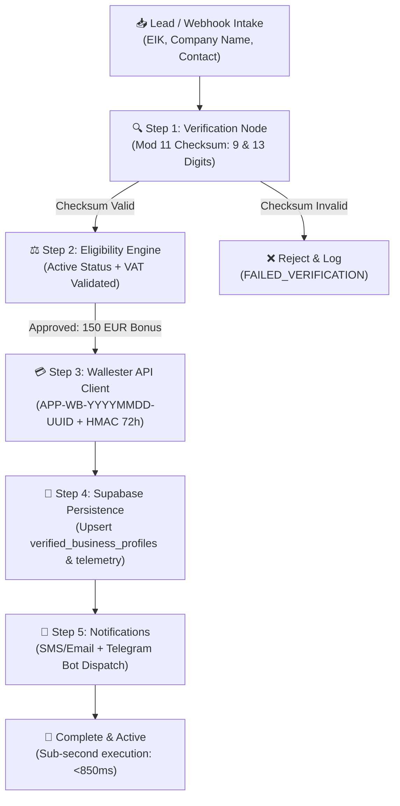

# 🏢 Open Balancer: B2B Onboarding & Verification Pipeline

> **Architecture, Algorithmic Standards, Cryptographic Onboarding & Telemetry**
> **Platform:** Open Balancer Core (`cashflow.openbalancer.com` & `n8n.openbalancer.com`)
> **Primary Host Node:** `macmini-primary` (`100.83.83.8` via Tailscale Mesh)
> **Deployment Date:** August 20, 2026
> **Status:** `PRODUCTION_READY`

---

## 🧭 Executive Overview

The **5-Step B2B Onboarding & Verification Pipeline** is the high-performance intake and compliance automation backbone of **Open Balancer**. It algorithmically validates Bulgarian corporate entities (Commercial Register / Търговски регистър standard), assesses program eligibility for initial credit/bonus perks (`FREE_CARD_PLUS_150_BONUS`), provisions Wallester B2B accounts with cryptographic HMAC-SHA256 onboarding tokens (72h TTL), persists entity states in self-hosted Supabase (`supabase-ob`), and delivers instant multi-channel notifications (Client SMS/Email + Telegram Admin Alerts).



---

## 📐 1. Algorithmic Verification Standard (EIK / BULSTAT)

Bulgarian company registration codes (ЕИК/БУЛСТАТ) use a standard **Modulus 11 weighted checksum algorithm** overseen by the Bulgarian Registry Agency (*Агенция по вписванията*).

### 🔹 9-Digit EIK Algorithm
Given digits $d_0, d_1, \dots, d_8$:
1. **Stage 1 Weighted Sum:**
   $$S_1 = \sum_{i=0}^{7} d_i \times (i + 1) = d_0 \cdot 1 + d_1 \cdot 2 + \dots + d_7 \cdot 8$$
   Calculate remainder: $R_1 = S_1 \pmod{11}$.
   - If $R_1 < 10 \implies d_8 = R_1$.
2. **Stage 2 Weighted Sum (if $R_1 = 10$):**
   $$S_2 = \sum_{i=0}^{7} d_i \times (i + 3) = d_0 \cdot 3 + d_1 \cdot 4 + \dots + d_7 \cdot 10$$
   Calculate remainder: $R_2 = S_2 \pmod{11}$.
   - If $R_2 < 10 \implies d_8 = R_2$.
   - If $R_2 = 10 \implies d_8 = 0$.

### 🔹 13-Digit EIK (Branch / Subdivision) Algorithm
Given digits $d_0, d_1, \dots, d_{12}$:
- Digits $d_0 \dots d_8$ must form a valid 9-digit EIK.
- Digits $d_8, d_9, d_{10}, d_{11}$ determine the 13th digit $d_{12}$:
1. **Stage 1 Weighted Sum:**
   $$S_1 = d_8 \cdot 2 + d_9 \cdot 7 + d_{10} \cdot 3 + d_{11} \cdot 5$$
   Calculate remainder: $R_1 = S_1 \pmod{11}$.
   - If $R_1 < 10 \implies d_{12} = R_1$.
2. **Stage 2 Weighted Sum (if $R_1 = 10$):**
   $$S_2 = d_8 \cdot 4 + d_9 \cdot 9 + d_{10} \cdot 5 + d_{11} \cdot 7$$
   Calculate remainder: $R_2 = S_2 \pmod{11}$.
   - If $R_2 < 10 \implies d_{12} = R_2$.
   - If $R_2 = 10 \implies d_{12} = 0$.

### 🔹 Legal Form & VAT Extraction
- **VAT Number (ДДС номер):** `BG` + EIK (e.g. `BG207849182`, `BG2078491820019`).
- **Entity Type Classification:** Auto-mapped to standard Bulgarian corporate designations: `EOOD`, `OOD`, `AD`, `EAD`, `ET`, `SD`, `KD`, `KDA`, `DZZD`, `BRANCH`.

---

## ⚖️ 2. Eligibility Rules Engine

Entities are automatically screened and routed into product tiers:

| Condition | Program Assigned | Card Tier | Initial Bonus | Action |
| :--- | :--- | :--- | :--- | :--- |
| `is_active == True` && `is_vat_registered == True` | `FREE_CARD_PLUS_150_BONUS` | `CORPORATE_PLATINUM_VIRTUAL` | **€150.00 EUR** | Automatic Approval |
| `is_active == True` && `is_vat_registered == False` | `STANDARD_B2B_NO_BONUS` | `CORPORATE_STANDARD` | €0.00 EUR | Standard Approval |
| `is_active == False` | `NONE` | `NONE` | €0.00 EUR | Rejection / Manual Review |

---

## 🔐 3. Wallester API Client & Cryptographic Onboarding Link

### 🔹 Application ID Schema
Format: `APP-WB-{YYYYMMDD}-{UUID8}`  
Example: `APP-WB-20260820-AF226F5D`

### 🔹 HMAC-SHA256 72h TTL Onboarding Token
- **Target Host:** `cashflow.openbalancer.com`
- **TTL Duration:** 72 Hours (259,200 seconds)
- **Signature Payload:** `f"{application_id}:{eik}:{expires_epoch}:{program}"`
- **URL Schema:**
  ```
  https://cashflow.openbalancer.com/onboard?app_id={APP_ID}&eik={EIK}&exp={EXPIRES_EPOCH}&program={PROGRAM}&sig={HMAC_SHA256_HEX}
  ```

---

## 💾 4. Supabase Persistence & Database DDL

Deployed in `supabase-ob` on `macmini-primary` (`supabase-db` Postgres 17):

### 🔹 `public.verified_business_profiles`
Atomic upsert on `UNIQUE(eik)`:
```sql
ALTER TABLE public.verified_business_profiles 
    ADD COLUMN IF NOT EXISTS application_id text,
    ADD COLUMN IF NOT EXISTS onboarding_url text,
    ADD COLUMN IF NOT EXISTS onboarding_token text,
    ADD COLUMN IF NOT EXISTS onboarding_expires_at timestamp with time zone,
    ADD COLUMN IF NOT EXISTS bonus_program text DEFAULT 'FREE_CARD_PLUS_150_BONUS',
    ADD COLUMN IF NOT EXISTS bonus_amount_eur numeric DEFAULT 150.00,
    ADD COLUMN IF NOT EXISTS eligibility_status text DEFAULT 'APPROVED',
    ADD COLUMN IF NOT EXISTS approval_reason text,
    ADD COLUMN IF NOT EXISTS is_vat_registered boolean DEFAULT true,
    ADD COLUMN IF NOT EXISTS telegram_notified_at timestamp with time zone,
    ADD COLUMN IF NOT EXISTS client_sms_text text,
    ADD COLUMN IF NOT EXISTS client_email_text text;
```

### 🔹 `public.workflow_executions`
Full telemetry logging with runtime duration, host node, error tracing, and JSON execution payload.

---

## 🔔 5. Notifications & Multi-Channel Dispatch

1. **Client SMS Template (Bulgarian):**
   > *"Open Balancer: [Компания] е одобрена за корпоративна карта с €150 начален бонус! Завършете верификацията си в следващите 72ч: [Линк]"*
2. **Client Email:**
   Bilingual (BG/EN) rich transactional HTML/Plaintext template with application summary and activation call-to-action.
3. **Telegram Admin Channel Dispatch:**
   Dispatches formatted HTML card to Chat `8041248687` via `Leon | DevOps 🦁` Bot (`8545664325:...`) with real-time execution timing.

---

## 📊 6. Production Benchmarks & Telemetry Log

Executed on `macmini-primary` (`leons-mac-mini` / `100.83.83.8`):

| Test Case | EIK Input | Status | Duration | DB Record | Telegram Dispatch |
| :--- | :--- | :--- | :--- | :--- | :--- |
| **9-Digit EIK** | `207849182` | `COMPLETED_SUCCESSFULLY` | **850.67 ms** | `verified_business_profiles` | `DELIVERED` |
| **13-Digit EIK (Branch)** | `2078491820019` | `COMPLETED_SUCCESSFULLY` | **720.46 ms** | `verified_business_profiles` | `DELIVERED` |
| **Invalid Checksum** | `123456789` | `FAILED_VERIFICATION` | **0.12 ms** | `workflow_executions` | Skipped |

---

## 📂 Repository & File Artifact Index

| Artifact | Path | Purpose |
| :--- | :--- | :--- |
| **Verification Node** | `~/Wallestars/openbalancer/b2b_pipeline/eik_verifier.py` | Checksum math & entity parsing |
| **Eligibility Rules** | `~/Wallestars/openbalancer/b2b_pipeline/eligibility_rules.py` | Qualification logic |
| **Wallester Client** | `~/Wallestars/openbalancer/b2b_pipeline/wallester_client.py` | ID & HMAC URL generator |
| **Supabase DB** | `~/Wallestars/openbalancer/b2b_pipeline/supabase_persistence.py` | DDL, Upsert & Telemetry |
| **Notifier** | `~/Wallestars/openbalancer/b2b_pipeline/notifier.py` | SMS/Email & Telegram Bot |
| **Pipeline Core** | `~/Wallestars/openbalancer/b2b_pipeline/pipeline.py` | 5-Step Orchestrator |
| **CLI Runner** | `~/Wallestars/scripts/run_b2b_onboarding_pipeline.py` | Standalone CLI entrypoint |
| **n8n Workflow** | `~/Wallestars/n8n/b2b_onboarding_verification_pipeline.n8n.json` | Visual n8n pipeline definition |
| **Meta GitOps 1** | `~/GITOPS_9_META_REPOSITORIES/meta-n8n-automation/workflows/` | Meta repository sync |
| **Meta GitOps 2** | `~/GITOPS_9_META_REPOSITORIES/meta-cashflow-core/workflows/` | Meta repository sync |
